<h1 align="center">BidX: Real-Time Auction/Bidding Platform (API)</h1>
<p align="center">
  <a href="https://bid-x.vercel.app/">Live Demo</a> &nbsp;&bull;&nbsp;
  <a href="https://bidx.runasp.net/swagger/index.html">Swagger Documentation</a> &nbsp;&bull;&nbsp;
  <a href="https://github.com/Youssef-Adell/BidX-Client">Frontend Repository</a>
</p>

## 📖 Overview  
**BidX** modernizes traditional auction processes by enabling real-time digital bidding. Users can participate in live auctions, place bids, track updates instantly, and interact securely with auction winners or auctioneers—all while receiving immediate notifications for critical actions like bid acceptance or outbidding.  

### Demo Video  
[](https://www.youtube.com/watch?v=xvVibJIRsc0)

### Key Features  
- **Real-Time Bidding**: Place and track bids with live price updates. Auctioneer can accept bids instantly.  
- **Real-Time Chat**: Chat is restricted to auction winners and auctioneers, with read receipts and user status indicators.  
- **Real-Time Notifications**: Bidders get alerts for accepted or outbid bids; auctioneers are notified of new bids.  
- **Real-Time Auctions Feed**: Live updates for new, deleted, or ended auctions, and price changes. Includes filtering and search.  
- **Reviews**: Reviews are allowed only between auction winners and auctioneers.  
- **Authentication**: Supports traditional email/password authentication and Google authentication.  

### Solution Architecture  
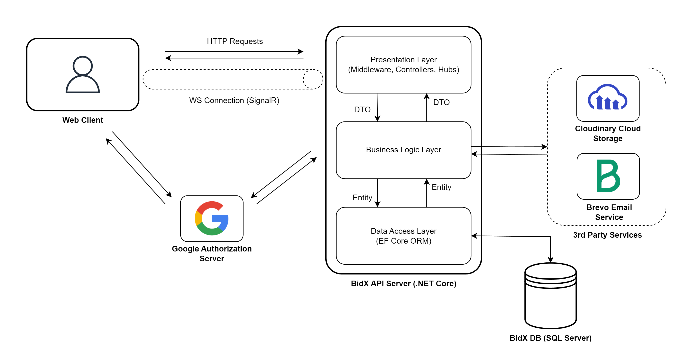

### Tech Stack  
- [ASP.NET Core 9](https://dotnet.microsoft.com/en-us/apps/aspnet/) - A free, cross-platform and open-source web-development framework.
- [Entity Framework Core 9](https://learn.microsoft.com/en-us/ef/core/) - An open source object–relational mapping framework.
- [Microsoft SQL Server](https://hub.docker.com/_/microsoft-mssql-server) - A relational database management system.
- [SignalR](https://dotnet.microsoft.com/en-us/apps/aspnet/signalr) - A library that enables real-time communication between servers and clients.
- [ASP.NET Core Identity](https://learn.microsoft.com/en-us/aspnet/core/security/authentication/identity) - A membership system for managing users, authentication, and authorization in ASP.NET Core applications.
- [JWT](https://jwt.io/) - A secure, compact token format used for transmitting information between parties as a JSON object.
- [Serilog](https://serilog.net/) - A logging library that allows logging to various outputs like files, console, etc.
- [MediatR](https://github.com/jbogard/MediatR) - A simple, unambitious mediator implementation in .NET for in-process messaging.
- [Quartz.NET](https://www.quartz-scheduler.net/) - An open source job scheduling system for .NET.
- [Docker](https://www.docker.com/) - A containerization platform for packaging applications and their dependencies.

### Third-Party Services
- [Google Identity Services (OpenID Connect)](https://developers.google.com/identity) - An authentication solution enabling secure sign-in with Google using OpenID Connect and OAuth 2.0.  
- [Cloudinary](https://cloudinary.com/) - A cloud-based service for file storage and image management. 
- [Brevo](https://www.brevo.com/) - An email sending service.  


## 🌐 REST API Documentation  
Check **[Swagger Documentation](https://bidx.runasp.net/swagger/index.html)** for full endpoint details.

### Authentication Flows
#### Google Login Flow
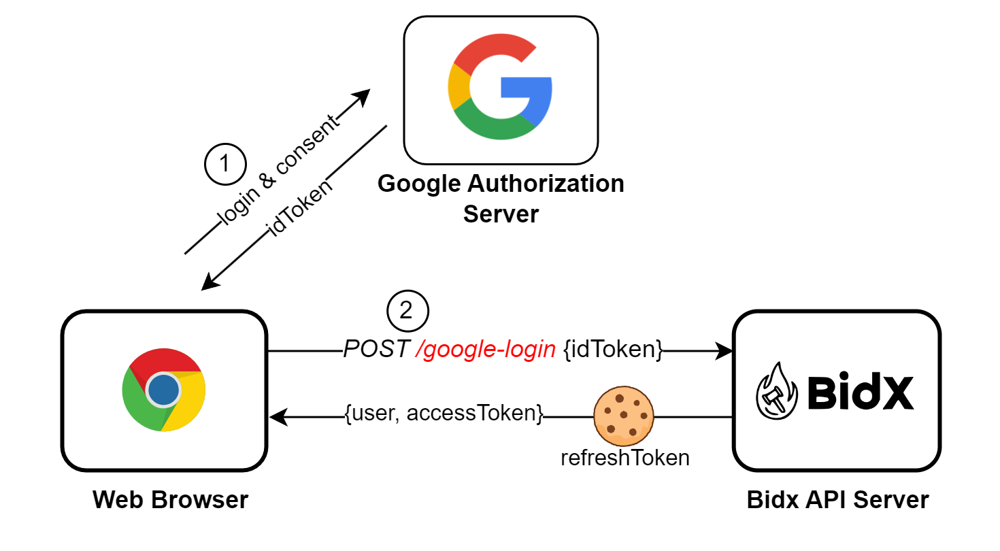

1. Client authenticates with Google to get an `idToken`.  
2. `idToken` is sent to the BidX API.  
3. API returns `userInfo` + `accessToken`, and sets a `refreshToken` in an HTTP-only cookie.

#### Email/Password Login Flow
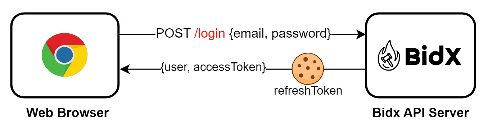

1. Client sends email/password to BidX API.  
2. API returns `userInfo` + `accessToken`, and sets a `refreshToken` in an HTTP-only cookie.  

#### Token Refresh Flow
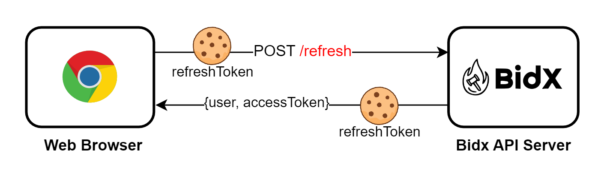

1. Client sends request to `/refresh` endpoint with the HTTP-only `refreshToken` cookie.  
2. API returns new `userInfo` + `accessToken`.  

> [!NOTE]
> Refresh tokens **returned in the response body for non-browser clients** (e.g., mobile apps).

### Error Handling
A standardized error response is returned if an error occurs.
```json
{  
  "errorCode": "AUTH_EMAIL_NOT_CONFIRMED",  
  "errorMessages": ["The email has not been confirmed"]  
}  
```
Here are the available [error codes](src/BidX.BusinessLogic/DTOs/CommonDTOs/ErrorCode.cs).

## ⚡ Real-Time API Documentation (SignalR)  

### Notes Before Starting 
- BidX uses a room-based **Pub-Sub model**:  
  - **Why?** To enhance the performance and prevent clients from being flooded with irrelevant events.  
- The connection **must be restarted when logging in or logging out**:
  - **Why?** To avoid an authorized connection being used by an unauthorized client or vice versa.

### Client Integration Example  
```javascript  
const connection = new signalR.HubConnectionBuilder()  
  .withUrl(`${import.meta.env.VITE_BIDX_API_URL}/hub`, {  
    accessTokenFactory: () => accessToken,  
    transport: signalR.HttpTransportType.WebSockets,  
    skipNegotiation: true       // Skip the negotiate request and establish the WS connection directly
  })  
  .withServerTimeout(10000)     // 2X the KeepAliveInterval value configured by the server
  .withKeepAliveInterval(5000)  // 0.5X the ClientTimeoutInterval value configured by the server
  .withAutomaticReconnect()  
  .build();  

// Start connection  
try {  
  await connection.start();  
} catch (err) {  
  console.log(err);  
}  

// Invoke server method  
connection.invoke("PlaceBid", { auctionId: "123", amount: 500 });  

// Listen for server event  
connection.invoke("JoinAuctionRoom");   // Subscribe to receive updates. 
connection.on("BidPlaced", (response) => {  
  console.log("New bid placed:", response);  
});
connection.invoke("LeaveAuctionRoom");  // Unsubscribe to stop receiving updates.
```

---
### Bidding Workflow  
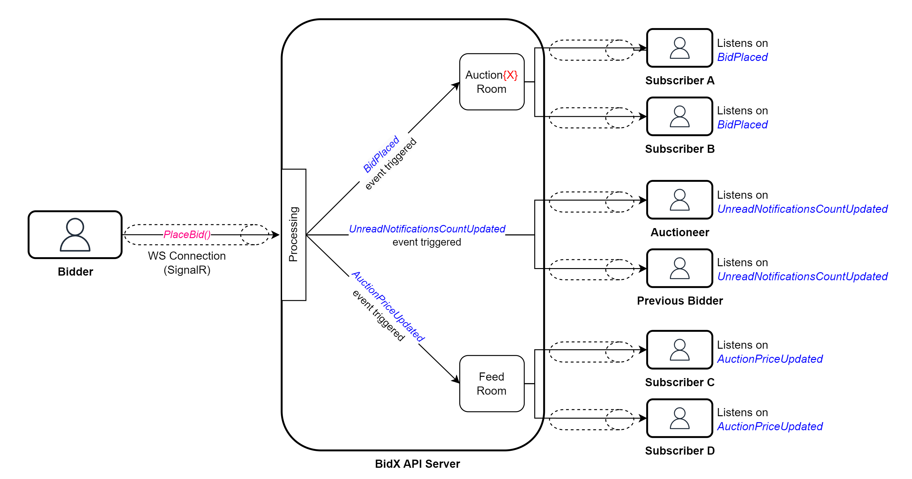
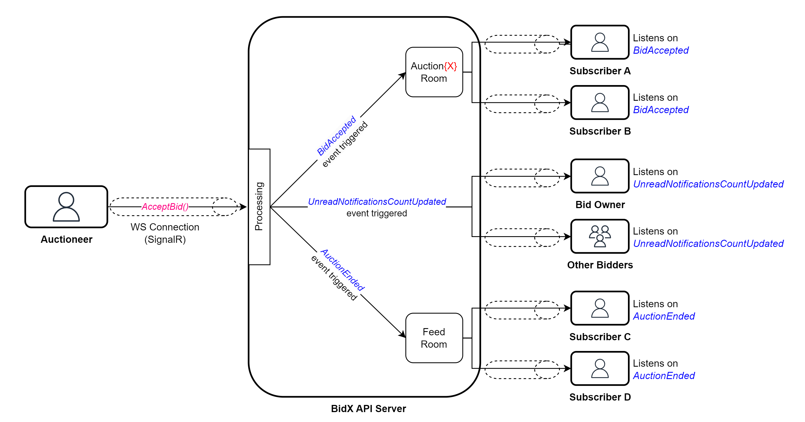

#### Client-to-Server Methods  

| Method | Parameters | Description |  
|------------|------------------------------------|----------------------------------|  
| `PlaceBid` | [`BidRequest`](src/BidX.BusinessLogic/DTOs/BidDTOs/BidRequest.cs) | Submit a bid for an auction. |  
| `AcceptBid` | [`AcceptBidRequest`](src/BidX.BusinessLogic/DTOs/BidDTOs/AcceptBidRequest.cs) | Auctioneer accepts a bid. |  
| `JoinAuctionRoom` | [`JoinAuctionRoomRequest`](src/BidX.BusinessLogic/DTOs/AuctionDTOs/JoinAuctionRoomRequest.cs) | Subscribe to auction updates. |  
| `LeaveAuctionRoom` | [`LeaveAuctionRoomRequest`](src/BidX.BusinessLogic/DTOs/AuctionDTOs/LeaveAuctionRoomRequest.cs) | Unsubscribe from auction updates.|  

#### Server-to-Client Events  
| Event                | Parameters                         | Audience               |  
|----------------------|------------------------------------|------------------------|  
| `BidPlaced`          | [`BidResponse`](src/BidX.BusinessLogic/DTOs/BidDTOs/BidResponse.cs) | Clients in auction room|  
| `BidAccepted`        | [`BidResponse`](src/BidX.BusinessLogic/DTOs/BidDTOs/BidResponse.cs) | Clients in auction room|  

---

### Auction Feed Workflow  
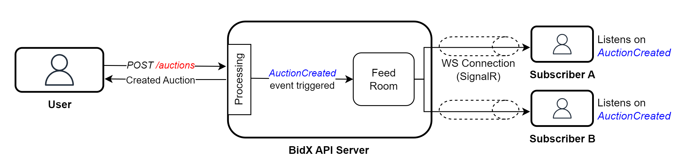
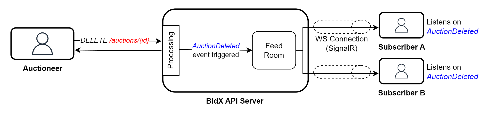

#### Client-to-Server Methods  
| Method             | Parameters | Description                |  
|--------------------|------------|----------------------------|  
| `JoinFeedRoom`     | *None*     | Subscribe to feed updates. |  
| `LeaveFeedRoom`    | *None*     | Unsubscribe from updates.  |  

#### Server-to-Client Events  
| Event                 | Parameters         | Audience          |  
|-----------------------|----------------------------------------|-------------------|  
| `AuctionCreated`      | [`AuctionResponse`](src/BidX.BusinessLogic/DTOs/AuctionDTOs/AuctionResponse.cs) | Feed room clients |  
| `AuctionDeleted`      | [`AuctionDeletedResponse`](src/BidX.BusinessLogic/DTOs/AuctionDTOs/AuctionDeletedResponse.cs) | Feed room clients |  
| `AuctionEnded`        | [`AuctionEndedResponse`](src/BidX.BusinessLogic/DTOs/AuctionDTOs/AuctionEndedResponse.cs) | Feed room clients |  
| `AuctionPriceUpdated` | [`AuctionPriceUpdatedResponse`](src/BidX.BusinessLogic/DTOs/AuctionDTOs/AuctionPriceUpdatedResponse.cs) | Feed room clients |  

---

### Chat Workflow  
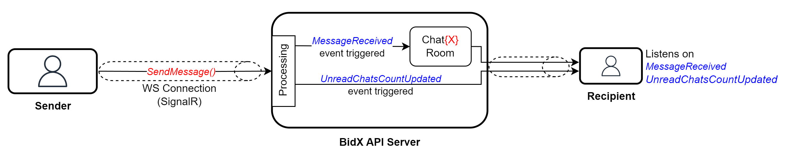
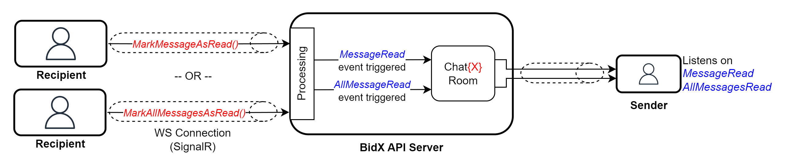
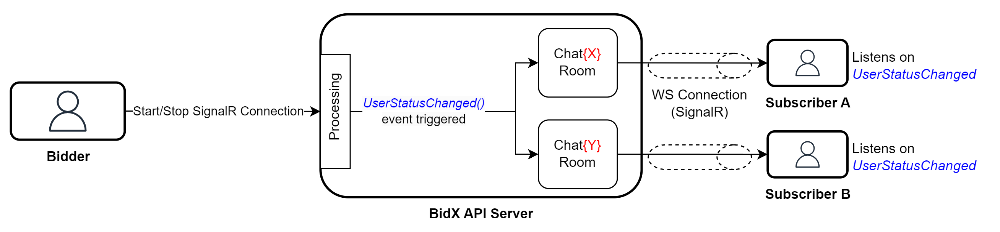

#### Client-to-Server Methods  
| Method               | Parameters     | Description                |  
|----------------------|------------------------------------|----------------------------|  
| `SendMessage`        | [`SendMessageRequest`](src/BidX.BusinessLogic/DTOs/ChatDTOs/SendMessageRequest.cs) | Send a chat message.       |  
| `MarkMessageAsRead`  | [`MarkMessageAsReadRequest`](src/BidX.BusinessLogic/DTOs/ChatDTOs/MarkMessageAsReadRequest.cs) | Mark a message as read.    |  
| `MarkAllMessagesAsRead`| [`MarkAllMessagesAsReadRequest`](src/BidX.BusinessLogic/DTOs/ChatDTOs/MarkAllMessagesAsReadRequest.cs) | Mark all messages received as read.    |  
| `JoinChatRoom`       | [`JoinChatRoomRequest`](src/BidX.BusinessLogic/DTOs/ChatDTOs/JoinChatRoomRequest.cs) | Subscribe to chat updates. |  
| `LeaveChatRoom`      | [`LeaveChatRoomRequest`](src/BidX.BusinessLogic/DTOs/ChatDTOs/LeaveChatRoomRequest.cs) | Unsubscribe from updates.  |  

#### Server-to-Client Events  
| Event                  | Parameters      | Audience          |  
|------------------------|------------------------------------|-------------------|  
| `MessageReceived`      | [`MessageResponse`](src/BidX.BusinessLogic/DTOs/ChatDTOs/MessageResponse.cs)             | Chat room clients |  
| `MessageRead`          | [`MessageReadResponse`](src/BidX.BusinessLogic/DTOs/ChatDTOs/MessageReadResponse.cs)         | Chat room clients |  
| `AllMessagesRead`      | [`AllMessagesReadResponse`](src/BidX.BusinessLogic/DTOs/ChatDTOs/AllMessagesReadResponse.cs)     | Chat room clients |  
| `UserStatusChanged`    | [`UserStatusResponse`](src/BidX.BusinessLogic/DTOs/ChatDTOs/UserStatusResponse.cs)          | Chat room clients |  
| `UnreadChatsCountUpdated` | [`UnreadChatsCountResponse`](src/BidX.BusinessLogic/DTOs/ChatDTOs/UnreadChatsCountResponse.cs) | Affected user     |  

---

### Notifications Workflow  
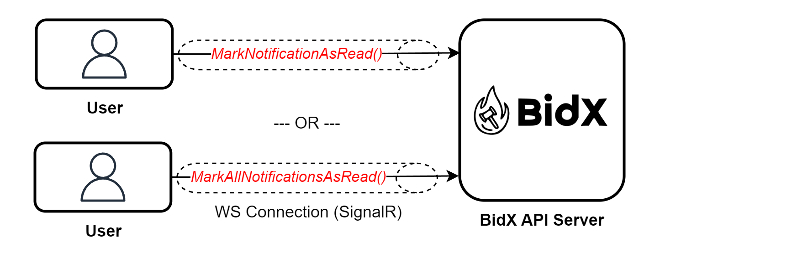

#### Client-to-Server Methods  
| Method                       | Parameters      | Description                  |  
|------------------------------|------------------------------------|------------------------------|  
| `MarkNotificationAsRead`     | [`MarkNotificationAsReadRequest`](src/BidX.BusinessLogic/DTOs/NotificationDTOs/MarkNotificationAsReadRequest.cs)| Mark a notification as read.|  
| `MarkAllNotificationsAsRead` | *None*                             | Mark all notifications received as read.|  

#### Server-to-Client Events  
| Event                          | Parameters          | Audience       |  
|--------------------------------|----------------------------------------|----------------|  
| `UnreadNotificationsCountUpdated` | [`UnreadNotificationsCountResponse`](src/BidX.BusinessLogic/DTOs/NotificationDTOs/UnreadNotificationsCountResponse.cs)| Affected user |  

---

### Error Handling
A standardized error response is returned if an error occur.
```json
{  
  "errorCode": "BIDDING_NOT_ALLOWED",  
  "errorMessages": ["Auction has ended"]  
}  
```
Errors triggered via `ErrorOccurred` event.
| Event          | Parameters | Audience          |  
|----------------|--------------------------------|-------------------|  
| `ErrorOccurred`| [`ErrorResponse`](src/BidX.BusinessLogic/DTOs/CommonDTOs/ErrorResponse.cs)           | Caller client only|  


# 🗃️ Database Design
Although I'm using the **EF Core Code First approach** (where the database is generated from the C# entity classes), I still prefer to start any project by designing the database and normalize it.

### ER Diagram
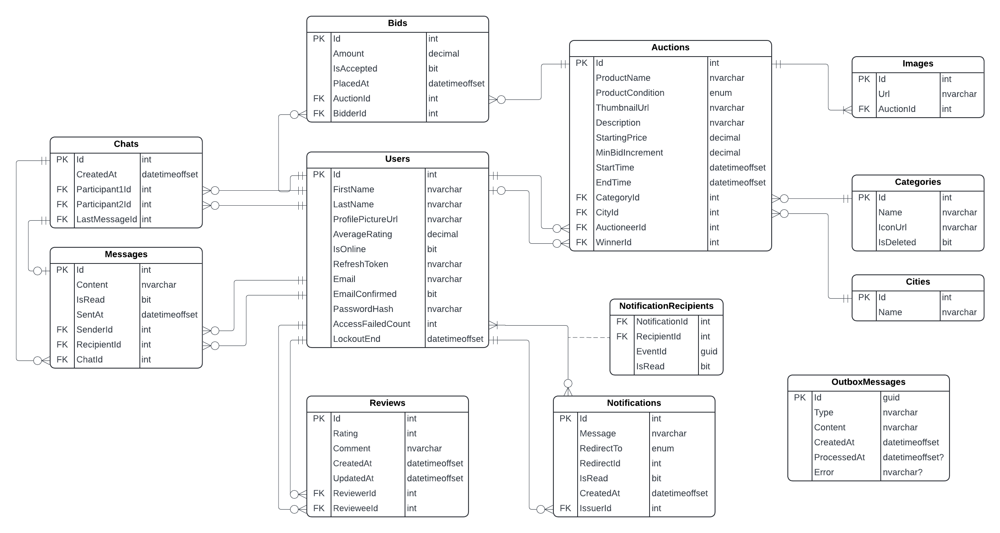

### Optimizations
The database is optimized for performance through **strategic denormalization** and **Covering indexes**:  
- **Denormalized Columns**:  
  - `Chat.LastMessageId`: Added to avoid expensive joins when fetching chats with their latest message.
  - `User.AverageRating`: Added to avoid expensive joins and calculations when fetching the users with their average rating.
- **Triggers**: Ensure denormalized columns stay synchronized with source data (e.g., updating `LastMessageId` when a message is added).
  - See the [`SQL/`](src/BidX.DataAccess/Configs/) folder for triggers definitions.  
- **Covering Indexes**: Applied to frequently queried columns to avoid full table scans.
  - See the [`Configs/`](src/BidX.DataAccess/Configs/) folder for index definitions.

> [!NOTE]
> Some auth-related tables have been omitted from the diagram for simplicity and clarity.


## 🚧 Challenges
Here are some challenges I encountered during development and the solutions I implemented to overcome them:
1. ### Handling Refresh Tokens Across different Clients
   - **Challenge**: Refresh tokens needed to be returned as **HTTP-only cookies** for browser clients (for security) and in the **response body** for non-browser clients (e.g., mobile apps).  
   - **Solution**: Used the [`User-Agent`](https://developer.mozilla.org/en-US/docs/Web/HTTP/Headers/User-Agent) HTTP header to detect the client type and conditionally set the token delivery method.  

2. ### Third-Party Cookie Restrictions
   - **Challenge**: Modern browsers **disable third-party cookies by default** or let users opt out to protect privacy. This broke token refreshes because the frontend (e.g., `bidx-app.com`) and backend (`bidx-api.com`) were on separate domains.  
   - **Solution**: Adopted [**CHIPS (Partitioned Cookies)**](https://developers.google.com/privacy-sandbox/cookies/chips).  
     - **How It Works**:  
       - The backend sets a `refreshToken` cookie with the `Partitioned` attribute.  
       - The cookie is stored in a **partitioned space**, tied strictly to the top-level domain (`bidx-app.com`).  
       - It’s sent **only** when the frontend explicitly calls the backend, avoiding cross-site tracking risks.  

3. ### Time Zone-Agnostic Auction Scheduling 
   - **Challenge**: Managing auction start and end times across different time zones without relying on user-local time inputs, which can lead to ambiguity due to regional offsets and daylight saving rules.  
   - **Solution**:  
     - **Duration-Based Scheduling**: Users specify auction duration in **seconds** (e.g., 86400 seconds for 24 hours).  
     - **UTC Anchoring**: Calculate and store the start time as `DateTimeOffset.UtcNow` and derive the end time by adding the duration to this UTC anchor.  
     - **Frontend Localization**: Display times in the user’s local time zone while processing all timestamps in UTC.  

4. ### Optimizing Auction Feed Loading Time 
   - **Challenge**: The auctions feed page (and other pages with auction lists) had slow loading times because the original uploaded images were used as thumbnails, which were large in size.  
   - **Solution**: Created a separate, compressed, lower-quality version of the image using **Cloudinary** to be set as a thumbnail for auctions and serve them for feed page and serve full-resolution images for auction details page only.  


## 🛠️ Setup & Run 
### 1. Prerequisites  
- Install [Docker](https://www.docker.com/) and [Docker Compose](https://docs.docker.com/compose/install/).  
- Clone the repository:  
```bash  
git clone https://github.com/Youssef-Adell/BidX-API.git 
cd BidX-API 
```
### 2. Configure Environment Variables  
- Rename the example files:  
  - `webapi.env.example` → `webapi.env`  
  - `sqlserver.env.example` → `sqlserver.env`  
- Update the `.env` files with your credentials:  
  - `webapi.env`: Add database connection strings, JWT secret, and third-party API keys.  
  - `sqlserver.env`: Set the SQL Server admin password.  

### 3. Edit [`appsettings.json`](src/BidX.Presentation/appsettings.json)  
Update the following attributes in `appsettings.json` as needed:  
```json  
"BrevoEmailApi": {
  "ConfirmationEmailTemplateId": "3",
  "PasswordResetEmailTemplateId": "5"
},
"Cors": {
  "FrontendOrigin": "http://localhost:3000"
},
"AuthPages": {
  "EmailConfirmationPageUrl": "http://localhost:3000/confirm-email",
  "ResetPasswordPageUrl": "http://localhost:3000/reset-password"
}
```

### 4. Start the Application  
Run the following command to build and start the containers:  
```bash  
docker-compose up --build  
```

- The API will be available at http://localhost:5000.
- SQL Server will be accessible at localhost:1433.

> [!NOTE]
> Database, logs, and DataProtection keys are stored in Docker volumes (sqlserver-data, webapi-logs, dataprotection-keys) to ensure data persistence and consistency across container restarts or rebuilds.

## 🚀 Future Enhancements
- #### Spam Bid Detection
  - Implement mechanisms to detect and block spam bids, ensuring fair auctions.  
- #### Image Moderation
  - Add automated checks to block inappropriate or harmful images uploaded by users.  
- #### Rate Limiting
  - Apply rate limits to critical endpoints to prevent abuse and ensure system stability.
